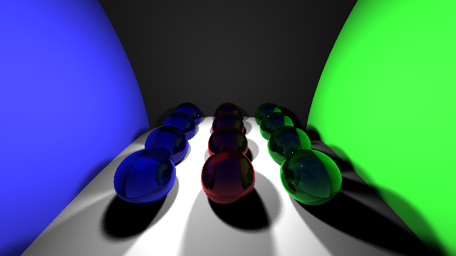

# Ray tracing in C++

This project served as an introduction to ray tracing.

The code supports Phong diffusion, reflection, refraction, point lights, soft shadows and anti-aliasing. Currently, only spheres can be rendered. Polygon meshes based on triangles will be added at some point in the near future.

A couple of helpful ray tracing/computer graphics resources:
- http://scratchapixel.com/
- https://www.youtube.com/watch?v=01YSK5gIEYQ&list=PLtzq_-2EVdoId2O2kPGgNY3k4lTvCxXI8 (UC Davis CG lectures)
- http://www.raytracegroundup.com/ (pdf)
- http://www.realtimerendering.com/raytracing/Ray%20Tracing%20in%20a%20Weekend.pdf (Peter Shirley series)

19 May 2019.
